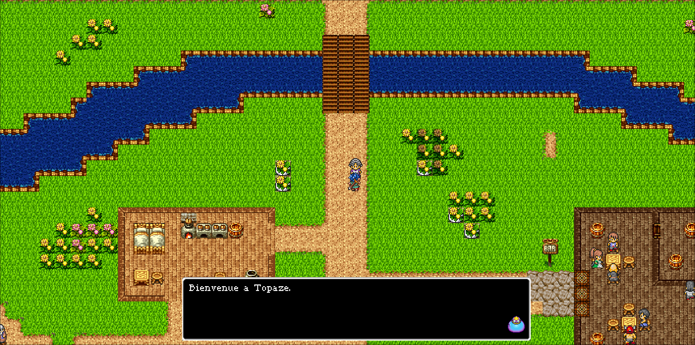
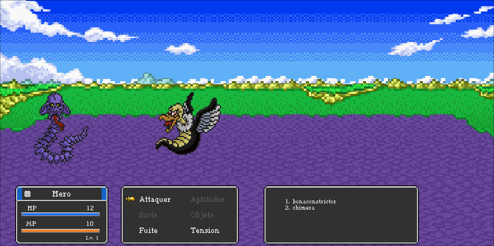
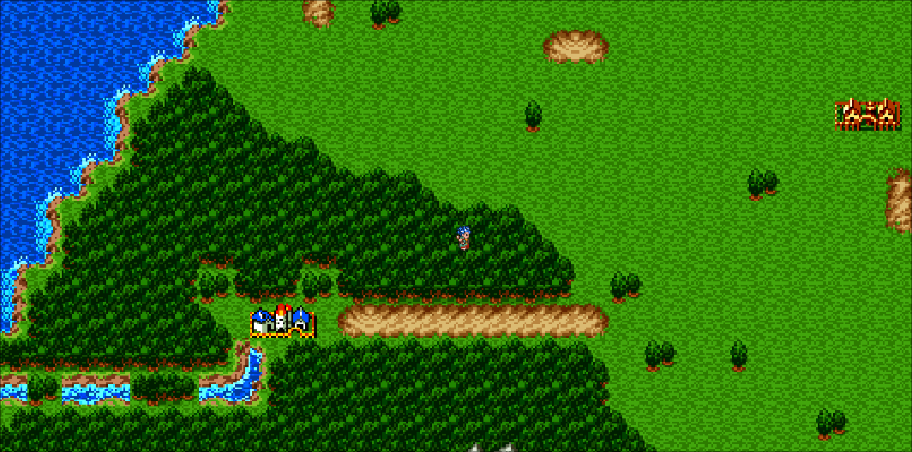
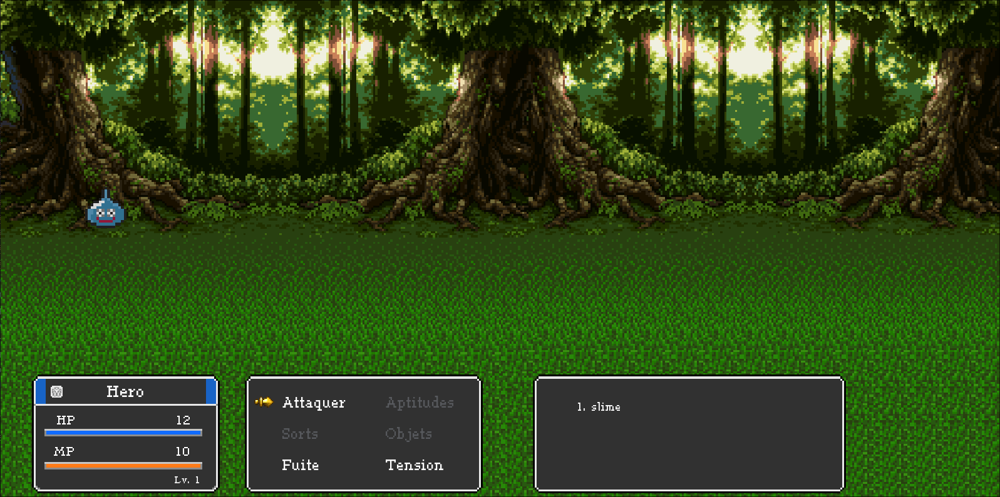

<h1 align="center">
  <br>
  
  
  <br>
  Epitech MyRPG
  <br>
</h1>

<h4 align="center">Un projet de fin de premiére année à Epitech</a>.</h4>

<p align="center">
  <a href="#description">Description</a> •
  <a href="#key-features">Fonctionnalités</a> •
  <a href="#how-to-use">Prérequis</a> •
  <a href="#download">How To Use</a> •
  <a href="#credits">Crédits</a> •
  <a href="#license">License</a>
</p>





## Description

MyRPG est un projet Epitech de fin de première année qui met a contribution les connaissances acquises en C avec la librairie graphique CSFML pendant notre premiére année d'apprentissage.

Ce projet a été développé en 5 semaines et à grandement été inspiré de la saga de RPG 'Dragon Quest'

## Fonctionalités

* Système de collision, de layers et de map editable avec Tiled (https://www.mapeditor.org/)
* Système de combat en tour par tour
* Items
* Fichier de configurations editables (dialogues, mouvements des NPCs, des textures, des enemies, items, de leurs caractéristiques ainsi que celui du joueur)
* Cross platform
  - Windows, macOS and Linux ready.


## Prérequis

- Git: pour cloner le dépôt.
- GCC: le compilateur pour compiler le code C.
- Make: pour automatiser le processus de compilation.
- CSFM: binding of SFML for the C language (https://www.sfml-dev.org/download/csfml/)

## How To Use

Pour cloner et exécuter cette application, vous aurez besoin de Git, GCC et Make installés sur votre ordinateur. Depuis votre ligne de commande :


```bash
# Clone this repository
$ git clone https://github.com/frnikho/Epitech_rpg

# Go into the repository
$ cd Epitech_rpg

# Install dependencies
$ make

# Run the app
$ ./my_rpg
```


## Crédits

Ce RPG à été développer par les personnes suivantes:


> [Nicolas SANS](https://github.com/frnikho) &nbsp;&middot;&nbsp;
> GitHub [@frnikho](https://github.com/frnikho)

> [Luann BERTAUD](https://github.com/luannbertaud) &nbsp;&middot;&nbsp;
> GitHub [@luannbertaud](https://github.com/luannbertaud)

> [Baptiste RENOUF](https://github.com/Tsaef) &nbsp;&middot;&nbsp;
> GitHub [@tsaef](https://github.com/Tsaef)


## License

MIT

## Screenshots







